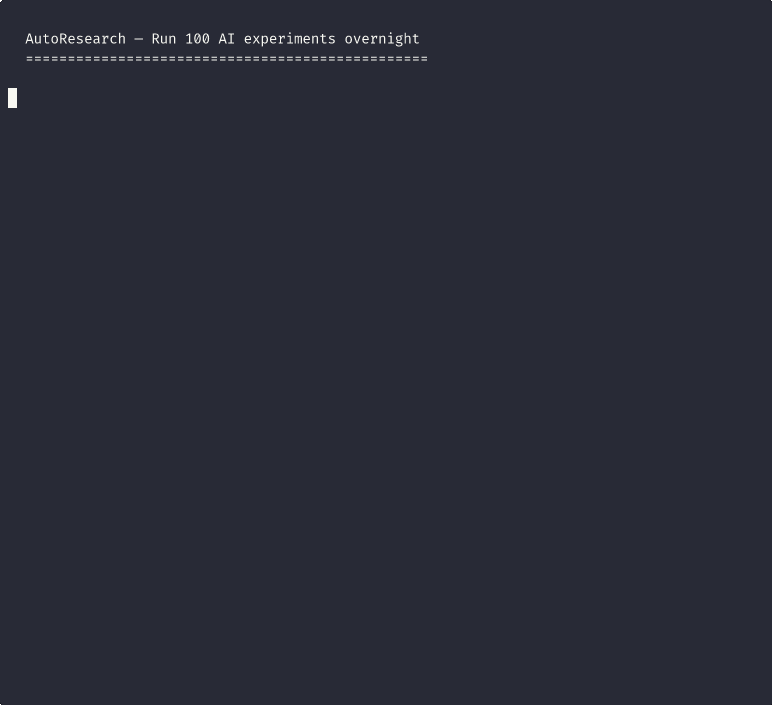

# autoresearch-oss

Autonomous experiment loop runner. Run 100 optimization experiments overnight — wake up to a better system.

**Cloud version with dashboard, parallel lanes, and team features:** [research.frozo.ai](https://research.frozo.ai)

Inspired by [karpathy/autoresearch](https://github.com/karpathy/autoresearch), generalized for CPU, any LLM provider, and any domain with a scoreable output.



## Quick Start

```bash
# Install
pip install autoresearch-cli

# Scaffold a new project (interactive wizard)
ars init

# Or use a template directly
ars init --template prompt-opt

# Set your LLM API key (Anthropic, OpenAI, or Gemini)
export ANTHROPIC_API_KEY=sk-ant-...

# Validate your setup before running
ars run --dry-run

# Run 50 experiments
ars run --max-experiments 50

# View results
ars results
ars diff
ars apply
```

## How It Works

1. Write a `program.md` describing your optimization goal
2. Provide a target file (prompt, config, copy, code) and an eval harness
3. Run `ars run`
4. The AI agent proposes changes, runs eval, keeps improvements, reverts failures
5. Repeat 100x overnight. Wake up to a better result.

```
                    ┌─────────────────┐
                    │  Read program.md │
                    └────────┬────────┘
                             │
                    ┌────────▼────────┐
              ┌────▶│  Create branch   │
              │     └────────┬────────┘
              │              │
              │     ┌────────▼────────┐
              │     │  LLM proposes    │
              │     │  a change        │
              │     └────────┬────────┘
              │              │
              │     ┌────────▼────────┐
              │     │  Run eval harness│
              │     └────────┬────────┘
              │              │
              │         ┌────▼────┐
              │         │Improved?│
              │         └──┬───┬──┘
              │        Yes │   │ No
              │     ┌──────▼┐ ┌▼──────┐
              │     │ KEEP  │ │REVERT │
              │     │ merge │ │discard│
              │     └───┬───┘ └───┬───┘
              │         │         │
              │     ┌───▼─────────▼───┐
              │     │  Log to results  │
              │     └────────┬────────┘
              │              │
              └──────────────┘
```

## What Can You Optimize?

| Use Case | Template | Target File | Eval Method |
|----------|----------|-------------|-------------|
| LLM system prompts | `prompt-opt` | `system_prompt.txt` | Test cases or AI judge |
| Config parameters | `config-tune` | `config.yaml` | Bash benchmark |
| Marketing copy | `copy-opt` | `landing_copy.txt` | AI judge |
| Code with failing tests | `test-pass` | `solution.py` | pytest pass rate |
| Standard procedures | `sop` | `sop.md` | AI judge |
| **Anything else** | `ars init` wizard | Your file | Your eval script |

All eval scripts are **provider-agnostic** — they auto-detect your LLM provider from environment variables. Works with Anthropic, OpenAI, and Gemini.

## CLI Reference

### `ars init`

Scaffold a new project with program.md and eval harness.

```bash
ars init                          # Interactive wizard
ars init --template prompt-opt    # Use a specific template
ars init --template config-tune --dir ./my-project
```

The wizard asks:
1. What do you want to optimize? (prompt, config, copy, code, custom)
2. For prompts: test cases or AI judge?
3. Target file name
4. LLM provider
5. Project directory

### `ars run`

Execute the autonomous experiment loop.

```bash
ars run                              # Run with defaults (100 experiments)
ars run --max-experiments 50         # Limit experiments
ars run --provider anthropic         # Use specific provider
ars run --model claude-sonnet-4-6    # Use specific model
ars run --dry-run                    # Validate setup only (no experiments)
ars run --cloud                      # Run on AutoResearch Cloud
ars run --cloud --lanes 4            # Cloud with 4 parallel lanes
ars run --verbose                    # Debug logging
```

Before starting, the CLI shows an estimated API cost:

```
  Provider: anthropic / claude-haiku-4-5-20251001
  Experiments: 50
  Estimated API cost: $0.85 - $1.70
  (charged to your API key, not AutoResearch)
```

**Dry run** validates your setup without running experiments:

```bash
$ ars run --dry-run
Dry run — validating setup...
  program.md: OK (goal: Optimize the system prompt to maximize accuracy)
  metric: accuracy_pct (higher_is_better=True)

  Running baseline eval: python eval.py
  PASS — eval exited cleanly
  Output: accuracy_pct:65.0

  Setup looks good. Run 'ars run' to start experiments.
```

### `ars results`

Display experiment results.

```bash
ars results              # Table format
ars results --json       # JSON output
ars results --csv        # CSV output
```

### `ars status`

Show summary of most recent run.

```bash
ars status               # Local results
ars status --cloud       # Open cloud dashboard
```

### `ars diff`

Show before/after comparison of the target file.

```bash
ars diff                 # Human-readable comparison
ars diff --raw           # Raw git diff format
ars diff --copy          # Copy best version to clipboard
```

### `ars apply`

Write the best version to your target file.

```bash
ars apply                # Interactive confirmation
ars apply --yes          # Skip confirmation
ars apply -f target.txt  # Specify target file
```

Creates a `.bak` backup before overwriting.

### `ars config`

Manage CLI configuration.

```bash
ars config show                  # Show all config + API key status
ars config set provider anthropic
ars config set model claude-sonnet-4-6
ars config get provider
```

### `ars login`

Authenticate with AutoResearch Cloud.

```bash
ars login                # Interactive email/password
```

### `ars deploy`

Push a local project to AutoResearch Cloud.

```bash
ars deploy               # Deploy current directory
ars deploy --name my-project
```

### `ars upgrade`

View AutoResearch Cloud pricing plans.

```bash
ars upgrade              # Opens pricing page
```

## Smart Loop Features

The experiment loop includes several intelligence features:

- **Adaptive early stopping** — Stops after 15 consecutive failures (configurable). Saves 60-80% wasted tokens on stuck runs.
- **Eval caching** — Skips eval when the LLM proposes identical content to a previous experiment (SHA-256 hash match).
- **Explore/exploit strategy** — Auto-switches between bold exploration (new approaches) and focused exploitation (refining what works).
- **Cross-run memory** — Subsequent runs on the same project remember what worked and what failed. The LLM won't re-try strategies that already failed.
- **Cancellation** — `Ctrl+C` stops cleanly, preserving all completed experiments.

## program.md Format

```markdown
# My Experiment

## Goal
Optimize system prompt accuracy on email classification task.

## Setup
Install dependencies if needed.

## Constraints
- DO NOT MODIFY: eval.py
- Keep prompt under 500 words

## Experiment Loop
1. Read the current system prompt
2. Run: python eval.py
3. Read metric: accuracy_pct from stdout
4. If improved: keep the change
5. If not improved: revert
6. LOOP FOREVER

## Metric
metric_name: accuracy_pct
higher_is_better: true
```

## Eval Harness Contract

Your eval script must:

1. Accept no arguments (config via env vars)
2. Print `metric_name:value` to stdout (e.g., `accuracy_pct:85.5`)
3. Exit 0 on success, non-zero on failure
4. Complete within 300 seconds (configurable via `TIME_BUDGET` env var)

Example eval output:
```
  Case 1/10: PASS (expected=billing, got=billing)
  Case 2/10: FAIL (expected=account, got=billing)
  ...
accuracy_pct:80.0
```

## Supported LLM Providers

| Provider | Env Variable | Default Model |
|----------|-------------|--------------|
| Anthropic | `ANTHROPIC_API_KEY` | claude-haiku-4-5-20251001 |
| OpenAI | `OPENAI_API_KEY` | gpt-4o-mini |
| Google Gemini | `GOOGLE_API_KEY` | gemini-1.5-flash |

All eval scripts auto-detect the provider from whichever API key is set in your environment.

## Environment Variables

| Variable | Purpose | Default |
|----------|---------|---------|
| `ANTHROPIC_API_KEY` | Anthropic API key | (required if using Anthropic) |
| `OPENAI_API_KEY` | OpenAI API key | (required if using OpenAI) |
| `GOOGLE_API_KEY` | Google Gemini API key | (required if using Gemini) |
| `LLM_PROVIDER` | Default provider | `anthropic` |
| `LLM_MODEL` | Default model | `claude-haiku-4-5-20251001` |
| `TIME_BUDGET` | Eval timeout (seconds) | `300` |

## AutoResearch Cloud

The CLI runs experiments locally on your machine. For teams, parallel execution, and a live dashboard — use [AutoResearch Cloud](https://research.frozo.ai).

### Local vs Cloud

| Feature | Local (this CLI) | Cloud |
|---------|-----------------|-------|
| Experiments | Up to 25 (free) / unlimited (logged in) | Unlimited |
| Parallel lanes | 1 (sequential) | Up to 16 |
| Live dashboard | Terminal output | Web UI with score charts, diffs |
| Run history | `results.tsv` file | Persistent across runs |
| Cross-run memory | Local only | Shared across team |
| Notifications | None | Email, Slack, webhooks |
| Team features | None | Shared projects, seats, SSO |
| Infra | Your machine | Hosted runners, auto-scaling |

### Get Started with Cloud

```bash
# Sign up at https://research.frozo.ai (free tier: 3 runs/month)

# Login from CLI
ars login

# Run on cloud with 4 parallel lanes
ars run --cloud --lanes 4 --max-experiments 100

# View results on dashboard
ars status --cloud
```

### Pricing

| Plan | Price | Runs | Lanes | Experiments |
|------|-------|------|-------|-------------|
| Free | $0/mo | 3/month | 1 | 25/run |
| Starter | $9/mo | 20/month | 2 | 100/run |
| Pro | $29/mo | Unlimited | 4 | 500/run |
| Team | $79/mo | Unlimited | 8 | 1000/run |

All plans are BYOK — you bring your own LLM API key. AutoResearch charges for infrastructure, not tokens.

## License

MIT
